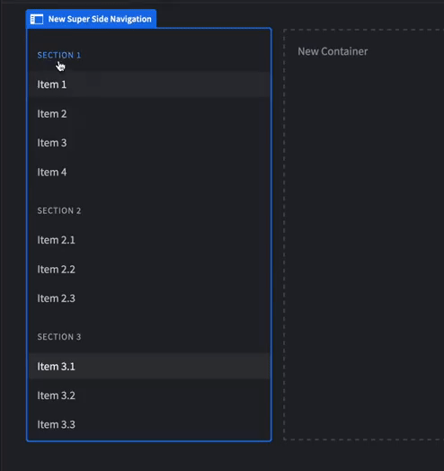

# Bb-component-SuperSideNavigation
A Side Navigation / Item List component for Budibase.

<div style="display: flex; flex-direction: row;">
        
        
</div>
# Description
You can use the Super Side Navigation component to create Navigation panels.
The sections and items of the Navigation list, can be populated from a Data Source,
or be statically defined using a JSON. 
The component will prefill the JSON definition with an example to help you get started !

<div style="display: flex; flex-direction: row;">
        
        
</div>


You can use the On Click event with the components exposed context to react to user interactions


Find out more about [Budibase](https://github.com/Budibase/budibase).

## Instructions

To build your new  plugin run the following in your Budibase CLI:
```
budi plugins --build
```

You can also re-build everytime you make a change to your plugin with the command:
```
budi plugins --watch
```

